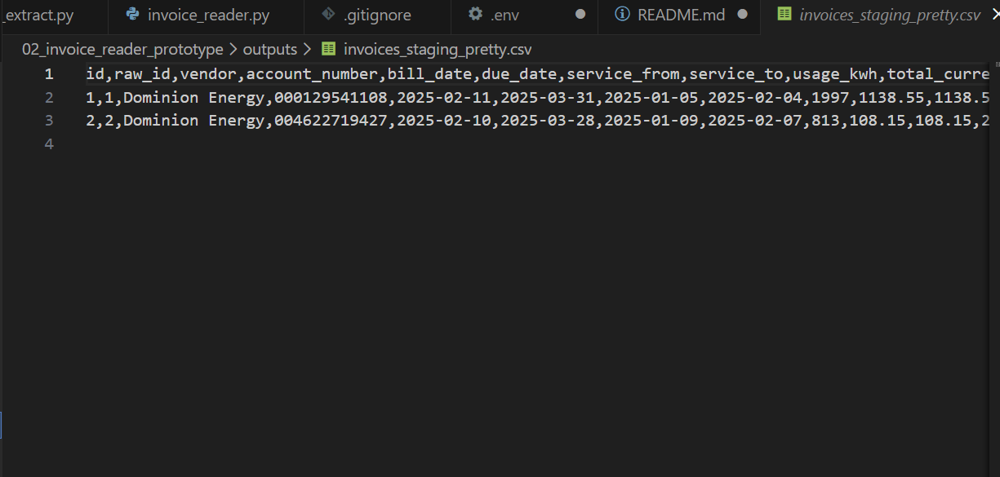
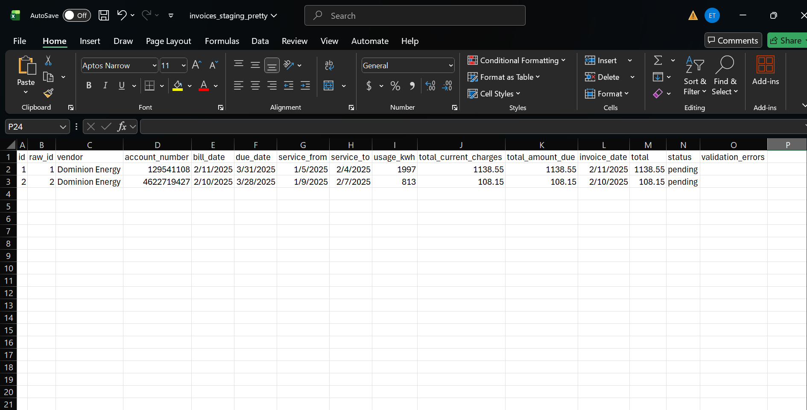

# Invoice Reader Prototype (Gemini + PDF → Structured Data)

A local prototype that processes utility invoice PDFs and extracts structured invoice fields using Gemini.
Results are stored in SQLite for traceability and exported to CSV for quick review.

## What this does
- Scans invoice PDFs placed in `data/` (also supports `data/invoices/`)
- Converts each PDF page to high-resolution images using Poppler
- Sends those images to Gemini to extract structured JSON fields (vendor, account #, dates, totals, kWh, etc.)
- Writes raw + extracted results to a local SQLite database (`outputs/invoices.sqlite`)
- Exports review-friendly CSV files:
  - `outputs/invoices_staging_pretty.csv` (recommended — easiest to read)
  - `outputs/invoices_staging.csv` (full staging table)
  - `outputs/invoices_raw.csv` (file metadata / audit trail)

## Project structure
02_invoice_reader_prototype/
data/ # input PDFs (drop invoices here)
invoices/ # optional alternate input folder
outputs/ # generated outputs (gitignored)
invoice_reader.py # pipeline runner
invoice_db.py # SQLite schema + init
gemini_extract.py # PDF→images + Gemini extraction helpers
requirements.txt # packages needed
.env # local secrets (gitignored)

## Example Output

Below is an example of the structured invoice data produced by the pipeline.
Raw PDF invoices are converted into structured, review-ready records that can
be audited, approved, or loaded downstream into accounting systems.

